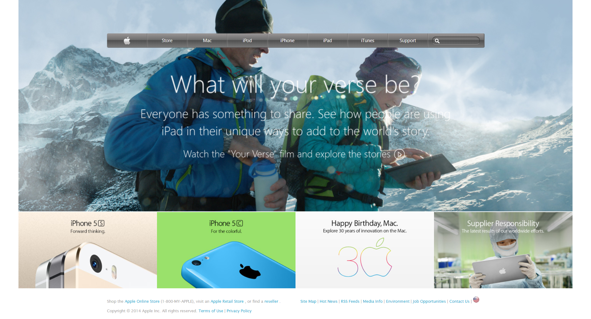

# Project Name

[Apple Website Clone](https://web.archive.org/web/20140301004610/http://www.apple.com/)

HTML & CSS Apple Website Clone

## Built With

- HTML,
- CSS

## Live Demo

[Live Demo Link](https://rawcdn.githack.com/hatemswaileh/Apple-Website-Clone/6c176d8780d9f10af10bb4154e869c9fcc9da061/index.html)

## Getting Started

To get a local copy up and running follow these simple example steps.

### Pre-Requisites

localhost or a web hosting

### Setup

Just download the files & upload it to your folder

### Usage

Apple Website Clone (Layout)

## Authors

### Solo Project
👤 **Hatem Sweileh**

- Github: [@hatemswaileh](https://github.com/hatemswaileh/)
- Twitter: [@hatemswaileh](https://twitter.com/hatemswaileh)
- Linkedin: [linkedin](https://www.linkedin.com/in/HatemSwaileh)

## 🤝 Contributing

Contributions, issues and feature requests are welcome!

Feel free to check the [issues page](issues/).

## Show your support

Give a ⭐️ if you like this project!

## 📝 Acknowledgments

- If you are applying issues, Please just use HTML & CSS
- Please keep in mind that this project is not fully functional, it's just a Layout Clone for Apple Website
